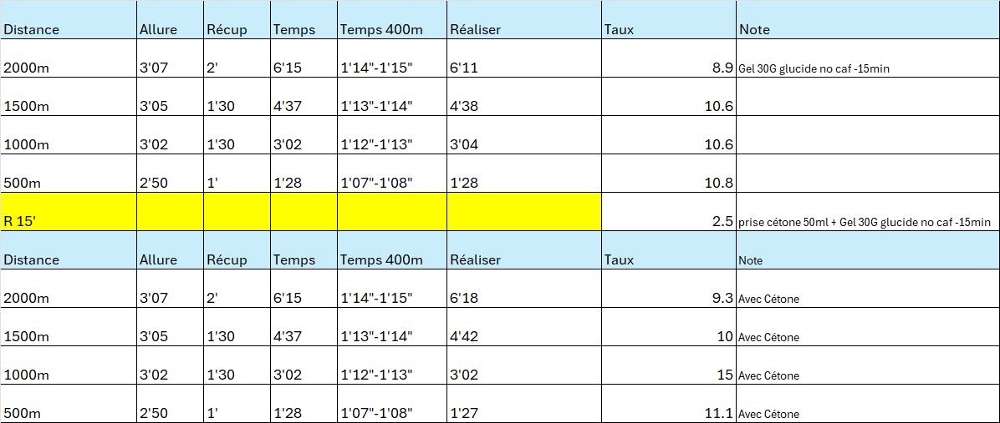

# Test du Lactate et des Cétones

Auteur : BLANC Swan

ÉQUIPE : NS-TEAM Infomaniak

Remerciements spéciaux à KetoneAid pour produire l'un des meilleurs esters de cétone sur le marché.

DATE de réalisation: 22/08/2024 à 18H

> Remarque: Ce test vise à initier des pistes de recherche sur les esters de cétone. Les résultats obtenus doivent être interprétés en conséquence et sont basés sur une seule et unique athlète.

## Contexte

Préparation intensive pour un marathon avec une charge d'entraînement hebdomadaire de 150 km. Le jour du test, un total de 60 km a été parcouru dans la semaine.
L'entrainement général s'est concentré sur les allures de 3'10", 3'15" et 3'20". En vue d'un travail de resistance dans l'optique du marathon, sans toutefois cibler spécifiquement l'adaptation à la résistance lactique pour les allures réaliser l'or du test.
**Conditions météorologiques** : Température élevée (~32 degrés Celsius) avec une résistance au vent de 4% mesurée par un capteur Stryd.

### Information athlète

- **VMA**: 23km/h
- **Taille**: 176cm
- **Masse**: 63kg
- **V02max**: 76ml/min/kg
- Non entraîné spécifiquement aux allures réalisées pendant la séance, car en phase terminale de préparation pour le marathon avec un fort volume kilométrique.

## Protocole

### Protocole et Mesures de Lactate

Dernier repas consommé à 9h avant l'effort :

- Un gel contenant 30g de glucides sans caféine, consommé 15 minutes avant la première série d'exercices.
- Un gel similaire accompagné de 25g d'ester de cétones (soit 50ml), consommé 15 minutes avant la seconde série d'exercices.

### Materiel

- Marque de Gel: https://www.precisionhydration.com/products/pf-30-gel/
- Marque de Cétone: https://shop.ketoneaid.com/fr/products/ke4
- Marque lecteur de lactate: Arkray "Lactate Pro 2" lactate meter from Axon Lab
- Capteur HR: Polar H10
- Capteur puissance: 2 x Stryd pied gauche & droit last generation from date 23/08/2024

## Résultats

Un gain notable en termes de récupération a été observé, avec une réduction rapide des niveaux de lactate à une valeur très basse de **2.5** en seulement 15 minutes. De plus, une augmentation des niveaux de lactate a été notée lors de la deuxième série d'exercices, suggérant que la supplémentation en esters de cétones pourrait avoir accru les niveaux de lactate, possiblement en augmentant la contribution énergétique anaérobie.

La supplémentation en esters de cétones semble également avoir abaissé le rythme cardiaque de **3%**, ce qui pourrait indiquer une amélioration de l'efficacité cardiovasculaire.

En ce qui concerne la puissance (W), aucune amélioration notable n'a été observée, mais il n'y a pas non plus de dégradation de la performance. Malgré une phase de récupération de 15 minutes, qui est relativement longue en termes physiologiques car cela peut perturber la dynamique de l'effort, elle reste trop courte pour permettre une récupération complète.

## Conclusion

Le test de lactate et de cétones a révélé plusieurs insights importants dans le contexte d'une préparation de marathon intensive :

1. **Amélioration de la Récupération** : Les niveaux de lactate ont diminué rapidement à une valeur très basse de **2.5** en seulement 15 minutes, indiquant une récupération efficace.
2. **Impact de la Supplémentation en Cétones** : La supplémentation en esters de cétones semble avoir augmenté les niveaux de lactate lors de la deuxième série d'exercices, suggérant une contribution énergétique anaérobie plus élevée. De plus, cette supplémentation a entraîné une réduction de la fréquence cardiaque de **3%**, potentiellement indicative d'une meilleure efficacité cardiovasculaire.
3. **Puissance Maintenue** : Aucun gain notable en termes de puissance n'a été observé, mais il est également important de souligner qu'il n'y a eu aucune dégradation des performances malgré la phase de récupération de 15 minutes. Bien que cette phase soit suffisante pour perturber la dynamique de l'effort physiologique, elle n'était pas suffisamment longue pour permettre une récupération complète.

En conclusion, les résultats suggèrent que la supplémentation en esters de cétones peut offrir des avantages significatifs en termes de récupération et d'efficacité cardiovasculaire, tout en maintenant une puissance de sortie constante. Il serait pertinent de continuer les recherches afin d'optimiser la durée de récupération et d'évaluer l'impact des cétones sur divers paramètres de performance. Parmi ceux-ci, l'étude inclut des vitesses de marathon à 3'15 par kilomètre, ainsi que des vitesses seuil hautes de 3'10 par kilomètre, correspondant aux vitesses typiques d'entraînement de l'athlète. 

L'hypothèse formulée est que les cétones pourraient entraîner un taux de lactate inférieur à ces vitesses.