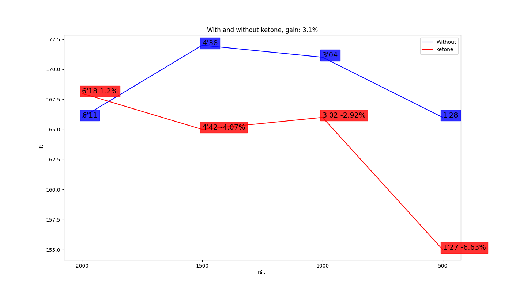

# Test du Lactate et des Cétones

> Remarque: Ce test vise à initier des pistes de recherche sur les esters de cétone. Les résultats obtenus doivent être interprétés en conséquence et sont basés sur une seule et unique athlète.

## Contexte

Préparation intensive pour un marathon avec une charge d'entraînement hebdomadaire de 150 km. Le jour du test, un total de 60 km a été parcouru dans la semaine.
L'entrainement général s'est concentré sur les allures de 3'10", 3'15" et 3'20". En vue d'un travail de resistance dans l'optique du marathon, sans toutefois cibler spécifiquement l'adaptation à la résistance lactique pour les allures réaliser l'or du test.
**Conditions météorologiques** : Température élevée (~32 degrés Celsius) avec une résistance au vent de 4% mesurée par un capteur Stryd.

### Information athlète

- **VMA**: 23km/h
- **Taille**: 176cm
- **Masse**: 63kg
- **V02max**: 76ml/min/kg
- Non entraîné spécifiquement aux allures réalisées pendant la séance, car en phase terminale de préparation pour le marathon avec un fort volume kilométrique.

## Protocole

### Protocole et Mesures de Lactate

Dernier repas consommé à 9h avant l'effort :

- Un gel contenant 30g de glucides sans caféine, consommé 15 minutes avant la première série d'exercices.
- Un gel similaire accompagné de 25g d'ester de cétones (soit 50ml), consommé 15 minutes avant la seconde série d'exercices.

Marque de Gel: https://www.precisionhydration.com/products/pf-30-gel/

Marque de Cétone: https://shop.ketoneaid.com/fr/products/ke4

## Résultats

Un gain notable en termes de récupération a été observé, avec une réduction rapide des niveaux de lactate à une valeur très basse de **2.5** en seulement 15 minutes. De plus, une augmentation des niveaux de lactate a été notée lors de la deuxième série d'exercices, suggérant que la supplémentation en esters de cétones pourrait avoir accru les niveaux de lactate, possiblement en augmentant la contribution énergétique anaérobie.

La supplémentation en esters de cétones semble également avoir abaissé le rythme cardiaque de **3%**, ce qui pourrait indiquer une amélioration de l'efficacité cardiovasculaire.

En ce qui concerne la puissance (W), aucune amélioration notable n'a été observée, mais il n'y a pas non plus de dégradation de la performance. Malgré une phase de récupération de 15 minutes, qui est relativement longue en termes physiologiques car cela peut perturber la dynamique de l'effort, elle reste trop courte pour permettre une récupération complète.

## Conclusion

Le test de lactate et de cétones a révélé plusieurs insights importants dans le contexte d'une préparation de marathon intensive :

1. **Amélioration de la Récupération** : Les niveaux de lactate ont diminué rapidement à une valeur très basse de **2.5** en seulement 15 minutes, indiquant une récupération efficace.
2. **Impact de la Supplémentation en Cétones** : La supplémentation en esters de cétones semble avoir augmenté les niveaux de lactate lors de la deuxième série d'exercices, suggérant une contribution énergétique anaérobie plus élevée. De plus, cette supplémentation a entraîné une réduction de la fréquence cardiaque de **3%**, potentiellement indicative d'une meilleure efficacité cardiovasculaire.
3. **Puissance Maintenue** : Aucun gain notable en termes de puissance n'a été observé, mais il est également important de souligner qu'il n'y a eu aucune dégradation des performances malgré la phase de récupération de 15 minutes. Bien que cette phase soit suffisante pour perturber la dynamique de l'effort physiologique, elle n'était pas suffisamment longue pour permettre une récupération complète.

En conclusion, les résultats suggèrent que la supplémentation en esters de cétones peut offrir des avantages significatifs en termes de récupération et d'efficacité cardiovasculaire, tout en maintenant une puissance de sortie constante. Il serait pertinent de continuer les recherches afin d'optimiser la durée de récupération et d'évaluer l'impact des cétones sur divers paramètres de performance. Parmi ceux-ci, l'étude inclut des vitesses de marathon à 3'15 par kilomètre, ainsi que des vitesses seuil hautes de 3'10 par kilomètre, correspondant aux vitesses typiques d'entraînement de l'athlète. 

L'hypothèse formulée est que les cétones pourraient entraîner un taux de lactate inférieur à ces vitesses.

-----------

# Lactate and Ketones Test

> Note: This test aims to initiate research pathways on ketone esters. The results obtained should be interpreted accordingly and are based on a single athlete.

## Context

Intensive preparation for a marathon with a weekly training load of 150 km. On the test day, a total of 60 km had been run during the week.
The general training focused on paces of 3'10", 3'15", and 3'20". The goal was to work on endurance in the context of marathon preparation, without specifically targeting lactate tolerance adaptation for the paces performed during the test.
**Weather conditions**: High temperature (~32 degrees Celsius) with 4% wind resistance measured by a Stryd sensor.

### Athlete Information

- **MAS**: 23 km/h
- **Height**: 176 cm
- **Weight**: 63 kg
- **VO2max**: 76 ml/min/kg
- Not specifically trained for the paces achieved during the session, as in the final preparation phase for the marathon with a high mileage volume.

## Protocol

### Lactate Protocol and Measures

Last meal consumed at 9 am before the effort:

- A gel containing 30g of carbohydrates without caffeine, consumed 15 minutes before the first series of exercises.
- A similar gel accompanied by 25g of ketone ester (i.e., 50 ml), consumed 15 minutes before the second series of exercises.

## Results

A notable gain in terms of recovery was observed, with a rapid reduction in lactate levels to a very low value of **2.5** in just 15 minutes. Additionally, an increase in lactate levels was noted during the second series of exercises, suggesting that supplementation with ketone esters might have raised lactate levels, possibly by increasing anaerobic energy contribution.

Ketone ester supplementation also seemed to lower the heart rate by **3%**, which could indicate improved cardiovascular efficiency.

Regarding power (W), no significant improvement was observed, but there was also no degradation in performance. Despite a 15-minute recovery phase, which is relatively long in physiological terms as it can disrupt the effort dynamics, it remains too short for complete recovery.

## Conclusion

The lactate and ketones test revealed several important insights in the context of intensive marathon preparation:

1. **Improved Recovery**: Lactate levels decreased rapidly to a very low value of **2.5** in just 15 minutes, indicating efficient recovery.
2. **Impact of Ketone Supplementation**: Ketone ester supplementation seemed to increase lactate levels during the second series of exercises, suggesting higher anaerobic energy contribution. Additionally, this supplementation resulted in a **3%** reduction in heart rate, potentially indicative of better cardiovascular efficiency.
3. **Maintained Power**: No significant gain in terms of power was observed, but it is also important to note that there was no degradation in performance despite the 15-minute recovery phase. While this phase is sufficient to disrupt the physiological effort dynamics, it was not long enough for complete recovery.

In conclusion, the results suggest that ketone ester supplementation can offer significant benefits in terms of recovery and cardiovascular efficiency, while maintaining constant power output. It would be pertinent to continue the research to optimize recovery duration and evaluate the impact of ketones on various performance parameters. These parameters include marathon paces at 3'15 per kilometer, as well as high threshold paces of 3'10 per kilometer, corresponding to the athlete’s typical training paces.

The hypothesis is that ketones could lead to a lower lactate rate at these paces.