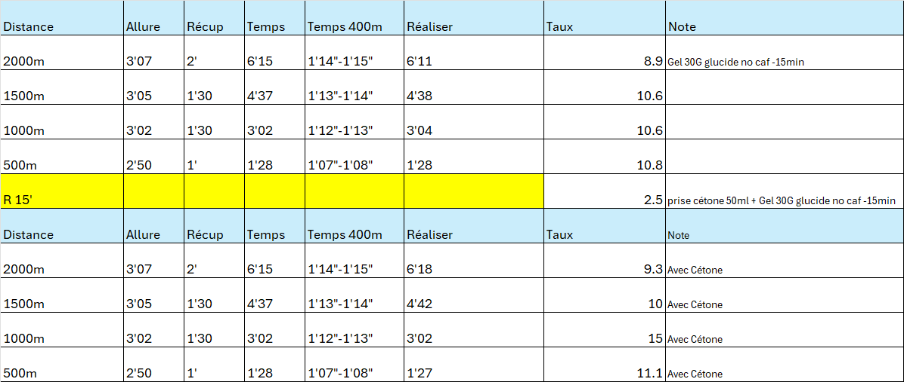
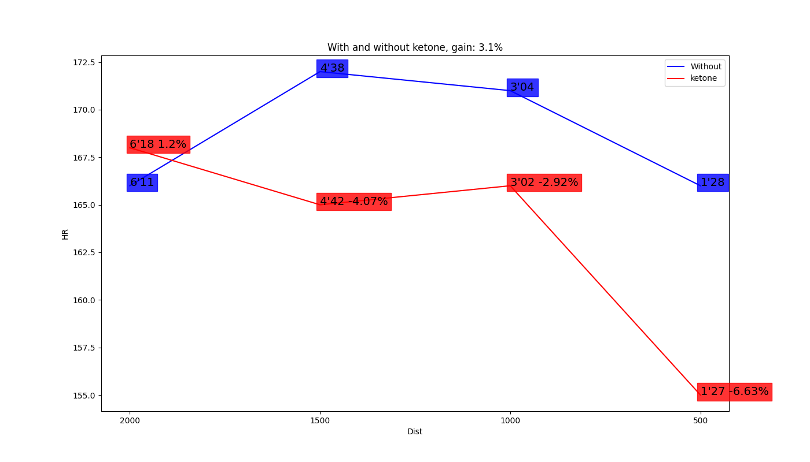
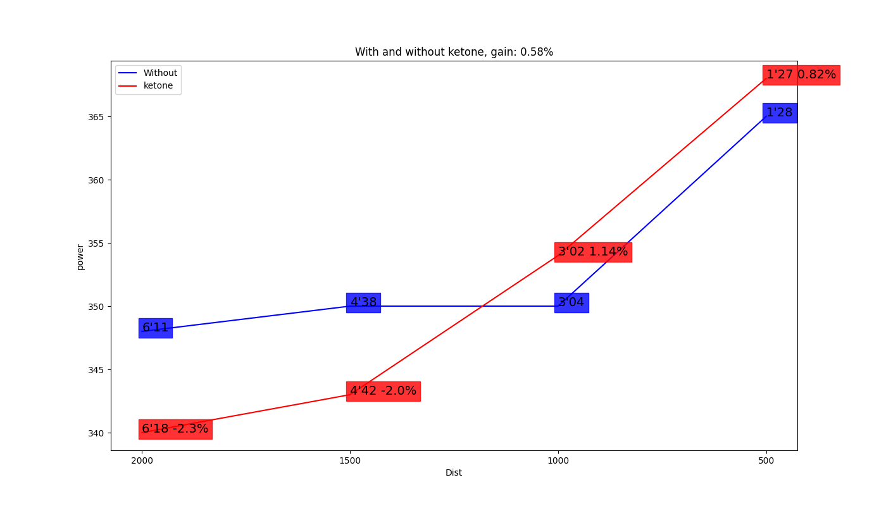

# Test of Lactate and Ketones

DATE conducted: 22/08/2024 at 18:00

> Note: This test aims to initiate research tracks on ketone esters. The results obtained should be interpreted accordingly and are based on a single athlete.

## Context

Intensive preparation for a marathon with a weekly training load of 150 km. On the day of the test, a total of 60 km had been covered during the week.
The general training focused on paces of 3'10", 3'15", and 3'20". In view of resistance work for the marathon, without specifically targeting lactate resistance adaptation for the paces performed during the test.
**Weather conditions**: High temperature (~32 degrees Celsius) with a wind resistance of 4% measured by a Stryd sensor.

### Athlete Information

- **VMA**: 23km/h
- **Height**: 176cm
- **Weight**: 63kg
- **V02max**: 76ml/min/kg
- Not specifically trained at the paces performed during the session, as in the final phase of preparation for the marathon with a high mileage volume.

## Protocol

### Protocol and Lactate Measurements

Last meal consumed at 9:00 before the effort:

- A gel containing 30g of carbohydrates without caffeine, consumed 15 minutes before the first series of exercises.
- A similar gel accompanied by 25g of ketone ester (i.e., 50ml), consumed 15 minutes before the second series of exercises.

### Material

- Gel Brand: [https://www.precisionhydration.com/products/pf-30-gel/](https://www.precisionhydration.com/products/pf-30-gel/)
- Ketone Brand: [https://shop.ketoneaid.com/fr/products/ke4](https://shop.ketoneaid.com/fr/products/ke4)
- Lactate meter brand: Arkray "Lactate Pro 2" lactate meter from Axon Lab
- HR sensor: Polar H10
- Power sensor: 2 x Stryd left and right foot last generation from date 23/08/2024

## Results

A notable gain in terms of recovery was observed, with a rapid reduction in lactate levels to a very low value of **2.5** in just 15 minutes. Additionally, an increase in lactate levels was noted during the second series of exercises, suggesting that supplementation with ketone esters could have increased lactate levels, possibly by increasing anaerobic energy contribution.

Ketone ester supplementation also seems to have lowered the heart rate by **3%**, which could indicate an improvement in cardiovascular efficiency.

Regarding power (W), no notable improvement was observed, but there was also no degradation in performance. Despite a 15-minute recovery phase, which is relatively long in physiological terms, as it can disrupt the dynamic of effort, it remains too short to allow complete recovery.

## Conclusion

The lactate and ketone test revealed several important insights in the context of intensive marathon preparation:

1. **Improved Recovery**: Lactate levels quickly decreased to a very low value of **2.5** in just 15 minutes, indicating effective recovery.
2. **Impact of Ketone Supplementation**: Supplementation with ketone esters appears to have increased lactate levels during the second series of exercises, suggesting a higher anaerobic energy contribution. Moreover, this supplementation resulted in a **3%** reduction in heart rate, potentially indicating better cardiovascular efficiency.
3. **Maintained Power Output**: No notable gain in terms of power was observed, but it is also important to highlight that there was no performance degradation despite the 15-minute recovery phase. Although this phase is sufficient to disrupt the physiological effort dynamic, it was not long enough to allow complete recovery.

In conclusion, the results suggest that ketone ester supplementation may offer significant benefits in terms of recovery and cardiovascular efficiency while maintaining constant power output. It would be pertinent to continue research to optimize recovery duration and evaluate the impact of ketones on various performance parameters. Among these, the study includes marathon speeds at 3'15 per kilometer, as well as high threshold speeds of 3'10 per kilometer, corresponding to the athlete's typical training speeds.

The formulated hypothesis is that ketones could lead to a lower lactate rate at these speeds.